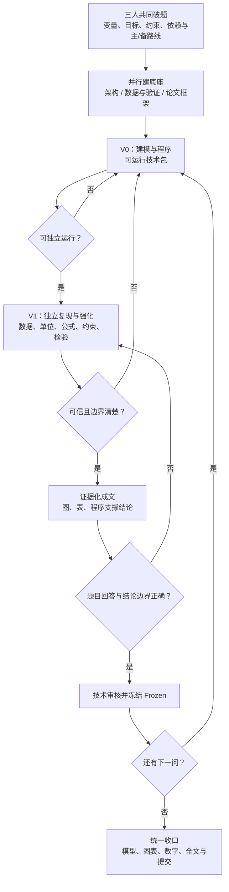

# Mathematical Modeling Team Workflow

三人数学建模团队的训练、课程作业与竞赛协作仓库。这里管理题面、数据、模型、复核、论文和最终归档；项目分支为 `practice/apmcm-2026-b`。

## 一张图看懂协作流程

每一问固定交付：**V0 技术包 → V1 复核包 → 论文段落 → Frozen 接口**。未经复核的 V0 不得成为正式结论；未冻结的结果不得作为下一问确定输入。

## 人员、角色与操作编码

`[A]`、`[B]`、`[C]` 是操作人编码，不是固定岗位。每次新对话先确认操作人；当前 Agent 为 `[A]`，其提交一律以 `[A]` 开头。角色按任务指定：

| 角色 | 主要目录 | 核心交付 |
| --- | --- | --- |
| Modeling Lead | `01_architecture/` `02_references/` `04_code/` `06_figures/` | 全题路线、V0、核心代码、正式图 |
| Validation Lead | `03_data/` `05_validation/` `08_results/` | 数据审计、独立复现、检验、正式数字 |
| Paper Lead | `07_paper/` `09_submission/` | 论文框架、正文、排版与提交文件 |

## 项目目录速览

| 目录 | 内容 | 关键规则 |
| --- | --- | --- |
| `00_problem/` | 题面与附件 | 原始材料不改写 |
| `03_data/raw/` | 原始数据 | 只读 |
| `03_data/processed/` | 可复现处理数据 | 必须能追溯到脚本 |
| `04_code/` | Q1–Q5 程序 | 固定入口、记录随机性 |
| `05_validation/` | 复核证据 | 由复核负责人维护 |
| `06_figures/` | 正式图 | 图名、来源脚本清楚 |
| `07_paper/` | `main.tex + main.pdf` | TEX 是源，PDF 是预览 |
| `08_results/` | 过程/验证/正式数值 | `final-results.md` 唯一正式数字源 |
| `09_submission/` | 待交/已交文件 | 不放中间稿 |

## 文件与 Git 规则

| 对象 | 规则 |
| --- | --- |
| TEX / PDF | 同名配对；只编辑 TEX，改后重新编译 PDF |
| CSV | 原始/处理/过程/验证/正式数据分目录；未经复核不能写入最终结论 |
| 文件名 | 小写英文、数字、`-`、`_`；版本由 Git 管理 |
| 本地操作 | Agent 默认检查、精确暂存并创建本地提交 |
| 远端操作 | 默认禁止；必须由当前请求明确授权 `git push` |

开始任务、交接和提交的完整清单见 [AGENTS.md](AGENTS.md)。
